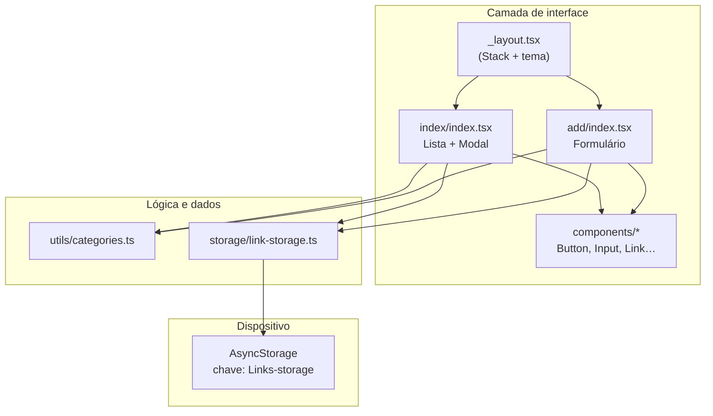
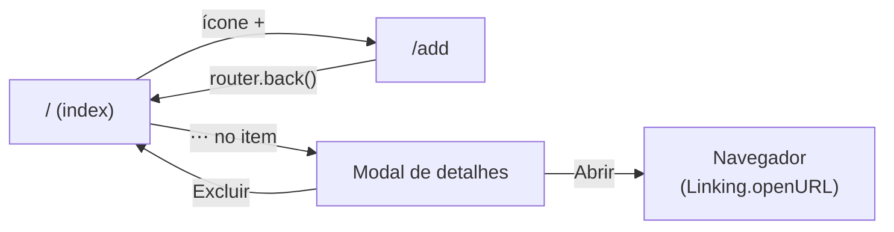
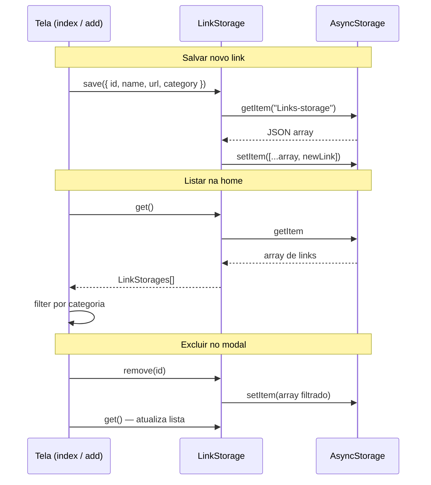
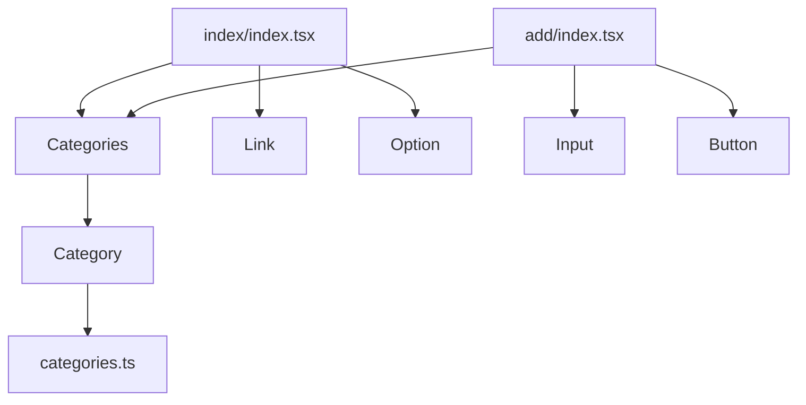

# Links

Aplicativo mobile para **salvar, organizar e abrir links favoritos** por categoria (Curso, Projeto, Site, Artigo, Vídeo, Documentação). Desenvolvido com **React Native** e **Expo**, com persistência local no dispositivo — sem backend.

---

## Funcionalidades

- Listar links salvos com filtro por categoria
- Adicionar novo link (nome, URL e categoria)
- Ver detalhes em modal (categoria, nome e URL)
- Abrir link no navegador do sistema
- Excluir link com confirmação
- Tema escuro consistente em todas as telas

---

## Tecnologias

| Tecnologia | Uso no projeto |
|------------|----------------|
| [Expo](https://expo.dev) (~54) | Toolchain, build e execução |
| [Expo Router](https://docs.expo.dev/router/introduction/) | Navegação baseada em arquivos (`src/app`) |
| React Native | Componentes nativos (`View`, `FlatList`, `Modal`, etc.) |
| TypeScript | Tipagem e autocomplete |
| AsyncStorage | Persistência local dos links em JSON |
| `@expo/vector-icons` | Ícones Material |

---

## Como executar

### Pré-requisitos

- [Node.js](https://nodejs.org/) (LTS recomendado)
- [Expo Go](https://expo.dev/go) no celular **ou** emulador Android/iOS configurado

### Passos

```bash
# Instalar dependências
npm install

# Iniciar o servidor de desenvolvimento
npm start
```

No terminal do Expo, escaneie o QR Code (Expo Go) ou pressione:

- `a` — Android
- `i` — iOS
- `w` — Web

Outros scripts úteis:

```bash
npm run android
npm run ios
npm run web
```

---

## Estrutura de pastas

```
Projeto-React-Native-2/
├── app.json                 # Configuração do Expo (nome, ícone, tema escuro)
├── babel.config.js          # Babel (preset expo)
├── package.json
├── tsconfig.json            # Alias @/* → src/*
│
└── src/
    ├── app/                 # Rotas (Expo Router)
    │   ├── _layout.tsx      # Layout raiz (Stack, fundo global)
    │   ├── index/
    │   │   └── index.tsx    # Tela inicial — lista + modal
    │   └── add/
    │       └── index.tsx    # Tela de cadastro
    │
    ├── components/          # UI reutilizável
    │   ├── button/
    │   ├── input/
    │   ├── link/            # Item da lista
    │   ├── option/          # Ação do modal (Abrir / Excluir)
    │   ├── category/        # Chip de categoria
    │   └── categories/      # Lista horizontal de categorias
    │
    ├── screens/add/         # Estilos das telas (legado da organização inicial)
    │   ├── styles.ts        # Estilos da tela index
    │   └── _styles.ts       # Estilos da tela add
    │
    ├── storage/
    │   └── link-storage.ts  # get / save / remove (AsyncStorage)
    │
    ├── utils/
    │   └── categories.ts    # Dados e helpers de categorias
    │
    ├── styles/
    │   └── colors.ts        # Paleta centralizada
    │
    └── assets/              # Imagens (ex.: logo.png)
```

O alias `@/` aponta para `src/` (definido em `tsconfig.json`). Exemplo: `import { colors } from "@/styles/colors"`.

---

## Arquitetura geral

Visão de como as camadas se conectam:



---

## Fluxo de navegação



| Rota | Arquivo | Responsabilidade |
|------|---------|------------------|
| `/` | `src/app/index/index.tsx` | Lista filtrada, modal, ir para add |
| `/add` | `src/app/add/index.tsx` | Formulário e salvar link |

---

## Fluxo de dados (persistência)



### Formato salvo no AsyncStorage

```json
[
  {
    "id": "1713456789012",
    "name": "Documentação Expo",
    "url": "https://docs.expo.dev",
    "category": "Curso"
  }
]
```

Chave única: `Links-storage` (ver `src/storage/link-storage.ts`).

---

## Componentes e responsabilidades



| Componente | Onde é usado | Função |
|------------|--------------|--------|
| `Categories` | index, add | Lista horizontal; filtro ou seleção de categoria |
| `Category` | dentro de Categories | Chip com ícone; destaque quando selecionado |
| `Link` | index | Uma linha da lista (nome, URL, botão ⋯) |
| `Option` | index (modal) | Botão ícone + texto (Abrir / Excluir) |
| `Input` | add | Campo de texto estilizado |
| `Button` | add | Botão primário "Adicionar" |

O componente `Categories` suporta modo **controlado** (`selected` + `onChange` do pai) ou **não controlado** (estado interno), útil para reutilização.

---

## Conceitos importantes (estudo)

### Expo Router (file-based routing)

Arquivos em `src/app` viram rotas automaticamente. `_layout.tsx` envolve as telas filhas; pastas como `index/` e `add/` definem as URLs `/` e `/add`.

### Estado com `useState`

Cada tela guarda seu próprio estado (lista, modal, formulário). Não há Context API nem Redux neste projeto — propositalmente simples para aprendizado.

### `useFocusEffect` (tela index)

Recarrega os links quando a tela **ganha foco** de novo (por exemplo, ao voltar de `/add` após salvar). Complementa o `useEffect` que reage à mudança de categoria no filtro.

### `FlatList`

Lista virtualizada: só renderiza itens visíveis, ideal para listas longas de links.

### `Modal` + `Linking`

O modal exibe detalhes sem sair da tela. `Linking.openURL` delega a abertura da URL ao sistema operacional.

### AsyncStorage

API assíncrona de armazenamento chave-valor. Os links são serializados com `JSON.stringify` / `JSON.parse`.

### Categorias e compatibilidade

Links antigos podem ter salvo o **id** da categoria (`"1"`) em vez do **nome** (`"Curso"`). As funções `getCategoryLabel` e `linkMatchesSelectedCategory` em `utils/categories.ts` tratam os dois formatos.

---

## Paleta de cores

Definida em `src/styles/colors.ts`:

- **Fundo geral:** `gray[950]` (`#09090B`)
- **Destaque / ações:** `green[300]` (`#2DD4BF`)
- **Textos secundários:** `gray[400]`

---

## Scripts npm

| Comando | Descrição |
|---------|-----------|
| `npm start` | Inicia o Expo Dev Tools |
| `npm run android` | Abre no Android |
| `npm run ios` | Abre no iOS |
| `npm run web` | Abre no navegador |

---

## Documentação no código

Os arquivos em `src/` contêm comentários em português explicando imports, funções, hooks e estilos. Use este README como mapa geral e o código comentado como guia linha a linha.

---

## Próximos passos (ideias opcionais)

- Editar link existente
- Busca por nome ou URL
- Validar formato de URL antes de salvar
- Exportar / importar backup JSON
- Migrar estilos de `screens/add` para pastas ao lado de cada tela em `app/`

---

Projeto de estudos em React Native — organização de links pessoais com persistência local e navegação moderna com Expo Router.
